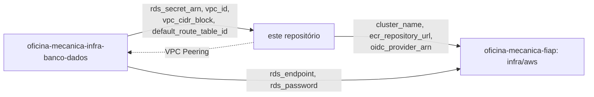

# oficina-mecanica-infra-kubernetes

Infraestrutura como código (Terraform) do **cluster Kubernetes (Amazon EKS)** do sistema de gestão de oficina mecânica — repositório 2 dos 4 exigidos pela Fase 3 do Tech Challenge (SOAT/FIAP).

Provisiona a VPC, o cluster EKS, o registro de imagens e a identidade/add-ons necessários para rodar a aplicação no cluster, de forma independente da aplicação em si e do banco de dados gerenciado.

## O que é provisionado

- VPC dedicada ao cluster (subnets públicas/privadas, NAT gateway).
- Cluster **Amazon EKS** + node group gerenciado com escalabilidade.
- Repositório **Amazon ECR** para a imagem da API (com lifecycle policy).
- IAM Role for Service Accounts (IRSA) para o AWS Load Balancer Controller e para o External Secrets Operator.
- Instalação via Helm do **AWS Load Balancer Controller**, do **External Secrets Operator** e do **metrics-server** (necessário para o HPA da aplicação).
- Instalação via Helm da **New Relic Kubernetes integration** (`nri-bundle`) — cobertura de infraestrutura do cluster para o monitoramento da Fase 3 ([ADR-0007](https://github.com/phantosmia/oficina-mecanica-fiap/blob/main/docs/adrs/0007-new-relic-como-plataforma-de-observabilidade.md)). Diferente do AWS Load Balancer Controller/External Secrets Operator, não depende de IRSA (não fala com nenhuma API da AWS) — só exige a variável `new_relic_license_key`.
- IAM Role OIDC para o GitHub Actions do repositório `oficina-mecanica-fiap` publicar imagens no ECR.

O **RDS PostgreSQL não é provisionado aqui**: é responsabilidade do repositório [`oficina-mecanica-infra-banco-dados`](https://github.com/phantosmia/oficina-mecanica-infra-banco-dados), que expõe seu próprio secret no Secrets Manager. Este repositório lê o ARN desse secret **automaticamente**, via `terraform_remote_state` contra o mesmo backend S3 compartilhado (ver `var.database_state_key`), só para autorizar o External Secrets Operator a lê-lo — não é preciso copiar esse ARN manualmente.

Os **secrets da aplicação** (senha admin, chave JWT, senha SMTP, senha do Postgres) e a IRSA role usada pelo pod da API para lê-los (`api_secrets_irsa`) também **não** ficam aqui: são responsabilidade do repositório [`oficina-mecanica-fiap`](https://github.com/phantosmia/oficina-mecanica-fiap) (aplicação principal), que lê o `oidc_provider_arn` exportado por este repositório automaticamente, também via `terraform_remote_state`.

## Tecnologias

- Terraform >= 1.6
- AWS EKS, VPC, ECR, IAM/IRSA
- Helm (AWS Load Balancer Controller, External Secrets Operator, metrics-server)
- GitHub Actions

## Por que separar do repositório da aplicação?

Fase 3 do Tech Challenge exige repositórios separados por responsabilidade, cada um com CI/CD e regras de proteção próprias. Separar a infraestrutura do cluster (que muda com pouca frequência e tem um ciclo de vida próprio) da aplicação que roda dentro dele (que muda a cada deploy) também reduz o raio de impacto de cada pipeline: um `terraform apply` aqui nunca reconstrói a aplicação, e um deploy da aplicação nunca reprovisiona o cluster.

## Uso local

```bash
cp backend.hcl.example backend.hcl   # ajuste bucket/tabela (mesmo backend do oficina-mecanica-fiap)
cp terraform.tfvars.example terraform.tfvars

terraform init -backend-config=backend.hcl
terraform plan
terraform apply
```

O backend remoto (S3 + DynamoDB) é o **mesmo** já criado por `infra/backend` no repositório `oficina-mecanica-fiap` — este repositório só usa uma `key` de state diferente (`kubernetes/<environment>/terraform.tfstate`), não cria um bucket/tabela novos.

Depois do `apply`:

```bash
terraform output -raw configure_kubectl_command   # copie e execute
terraform output -raw ecr_login_command           # copie e execute
```

## AWS Academy Lab

O AWS Academy Lab bloqueia `iam:CreateRole` e algumas chamadas de `iam:GetRole`. Para esse cenário:

- defina `eks_admin_principal_arn`, `eks_cluster_role_arn` e `eks_node_role_arn` com as roles pré-criadas do lab;
- defina `enable_irsa_resources = false` e `enable_github_actions_oidc = false` (o lab não permite criar os recursos IAM/OIDC necessários).

O workflow de CI/CD já aplica esses ajustes automaticamente no modo `aws-academy` — ver seção CI/CD.

## CI/CD

Workflow em [`.github/workflows/terraform.yml`](.github/workflows/terraform.yml):

- **Pull Request**: `terraform fmt -check`, `validate` e `plan` (sem backend remoto — validação de sintaxe/config, não reflete um ambiente real).
- **Push para `homologacao` ou `producao`** (ou `workflow_dispatch` manual): `init` (backend remoto, state `kubernetes/<branch>/terraform.tfstate`), ajustes no módulo EKS vendorizado (compatibilidade com AWS Academy e escalabilidade de `desired_size`), `plan` e `apply` automático.
- Modo de autenticação AWS configurável via `vars.AWS_AUTH_MODE` (ou input `auth_mode` no `workflow_dispatch`): `oidc` ou `aws-academy` (padrão).

### Regras de proteção

- Branch `main` protegida: sem commit direto, merge só via Pull Request.
- `homologacao` e `producao` disparam `apply` automático no push (ambientes GitHub `homologacao`/`producao`, o que permite configurar secrets/aprovações por ambiente).

### Secrets e variables necessários

| Tipo | Nome | Descrição |
|---|---|---|
| Secret | `AWS_ACCESS_KEY_ID` | Modo `aws-academy`: access key temporária do AWS Academy Lab |
| Secret | `AWS_SECRET_ACCESS_KEY` | Modo `aws-academy`: secret key temporária |
| Secret | `AWS_SESSION_TOKEN` | Modo `aws-academy`: session token temporário |
| Secret | `AWS_DEPLOY_ROLE_TO_ASSUME` | Modo `oidc`: role com permissão para Terraform/EKS (alternativa: `AWS_ROLE_TO_ASSUME`) |
| Secret | `TF_BACKEND_CONFIG` | Conteúdo completo de um `backend.hcl` (alternativa às variables abaixo) |
| Secret | `NEW_RELIC_LICENSE_KEY` | ADR-0007. Vazio não instala a New Relic Kubernetes integration |
| Variable | `AWS_REGION` | Região AWS |
| Variable | `AWS_AUTH_MODE` | `oidc` ou `aws-academy` (padrão) |
| Variable | `TF_STATE_BUCKET` | Bucket S3 do state (mesmo do `oficina-mecanica-fiap`) |
| Variable | `TF_LOCK_TABLE` | Tabela DynamoDB de lock (mesma do `oficina-mecanica-fiap`) |
| Variable | `TF_STATE_REGION` | Região do backend S3 |
| Variable | `EKS_ADMIN_PRINCIPAL_ARN` | AWS Academy: principal administrativo do EKS |
| Variable | `EKS_CLUSTER_ROLE_ARN` | AWS Academy: role do control plane |
| Variable | `EKS_NODE_ROLE_ARN` | AWS Academy: role do node group |
| Variable | `NODE_DESIRED_SIZE` / `NODE_MIN_SIZE` / `NODE_MAX_SIZE` / `NODE_DISK_SIZE` | Tamanho do node group |

Não há mais uma variable `RDS_SECRET_ARN`: o ARN do secret do RDS é lido automaticamente via `terraform_remote_state` (ver seção abaixo).

## Integração com os outros repositórios (via `terraform_remote_state`)

Este repositório e o `oficina-mecanica-fiap` compartilham o mesmo backend S3 (criado por `infra/backend` naquele repositório). Isso permite que os outputs fluam entre as stacks **automaticamente**, sem copiar variables manualmente:

- Este repositório lê `rds_secret_arn` do state do `oficina-mecanica-infra-banco-dados` (`data.terraform_remote_state.database`, key controlada por `var.database_state_key`) para autorizar o External Secrets Operator.
- Este repositório também lê `vpc_id`, `vpc_cidr_block` e `default_route_table_id` do mesmo state para criar um **VPC Peering** entre a VPC do EKS e a VPC do banco (`aws_vpc_peering_connection.eks_to_database`) — os pods da aplicação principal, nesta VPC, precisam alcançar o RDS, que fica isolado numa VPC própria sem Internet Gateway/NAT (ver ADR-0005 em `oficina-mecanica-fiap`). A rota "de volta" (`aws_route.database_to_private`) também é criada por aqui, mirando a route table da VPC do banco via esses mesmos outputs — a ordem de apply da Fase 3 garante que o state do banco já existe neste ponto, mas o inverso não é verdade, por isso o peering não pode ser criado no repositório do banco. O security group do RDS (`allowed_cidr_blocks` naquele repositório) continua exigindo liberação manual do CIDR desta VPC — o peering resolve só o roteamento, não a autorização.
- O repositório `oficina-mecanica-fiap` lê `cluster_name`, `ecr_repository_url` e `oidc_provider_arn` **deste** repositório (`data.terraform_remote_state.kubernetes`) e `rds_endpoint`/`rds_password` do `oficina-mecanica-infra-banco-dados`.



Isso exige uma ordem de apply: `oficina-mecanica-infra-banco-dados` → este repositório → `oficina-mecanica-fiap`. Se o state de um deles ainda não existir na `key` esperada (ex.: `database/homologacao/terraform.tfstate` nunca foi criado porque aquele repositório nunca foi aplicado nesse ambiente), o `terraform plan`/`apply` do próximo **falha imediatamente**, não silenciosamente:

```
Error: Unable to find remote state
No stored state was found for the given workspace in the given backend.
```

O workflow [`terraform.yml`](.github/workflows/terraform.yml) já detecta esse erro específico (procura por "Unable to find remote state" no log do `plan`) e imprime qual repositório aplicar primeiro. Localmente, a correção é sempre a mesma: aplique o `oficina-mecanica-infra-banco-dados` primeiro, no mesmo ambiente que este repositório está tentando ler (`var.database_state_key`).

Só dois valores **não** podem ser automatizados por não serem dado de state, e continuam manuais:

| Output deste repositório | Onde colar |
|---|---|
| `terraform output -raw github_actions_ecr_role_arn` | `oficina-mecanica-fiap`, GitHub **secret** `AWS_ROLE_TO_ASSUME` (workflow `publish-ecr.yml`, modo `oidc`) — é uma credencial de CI, não dado de infraestrutura, então não pode ser lida de dentro do Terraform de outro repositório. |
| `terraform output -raw vpc_cidr_block` | `oficina-mecanica-infra-banco-dados`, variable/tfvars `allowed_cidr_blocks` (ou VPC peering) — deixado manual de propósito: popular isso automaticamente afetaria as regras do security group do RDS a cada apply deste repositório, o que preferimos manter como uma decisão explícita. |

## Variáveis e outputs

Ver [`variables.tf`](variables.tf) e [`outputs.tf`](outputs.tf) para a lista completa, com descrições.

## Repositórios relacionados

- [oficina-mecanica-fiap](https://github.com/phantosmia/oficina-mecanica-fiap) — aplicação principal (roda no cluster criado aqui; cria os secrets da API e a IRSA role do próprio pod em `infra/aws`).
- [oficina-mecanica-infra-banco-dados](https://github.com/phantosmia/oficina-mecanica-infra-banco-dados) — infraestrutura do banco de dados gerenciado.
- [oficina-mecanica-lambda-auth](https://github.com/phantosmia/oficina-mecanica-lambda-auth) — function serverless de autenticação via CPF.
